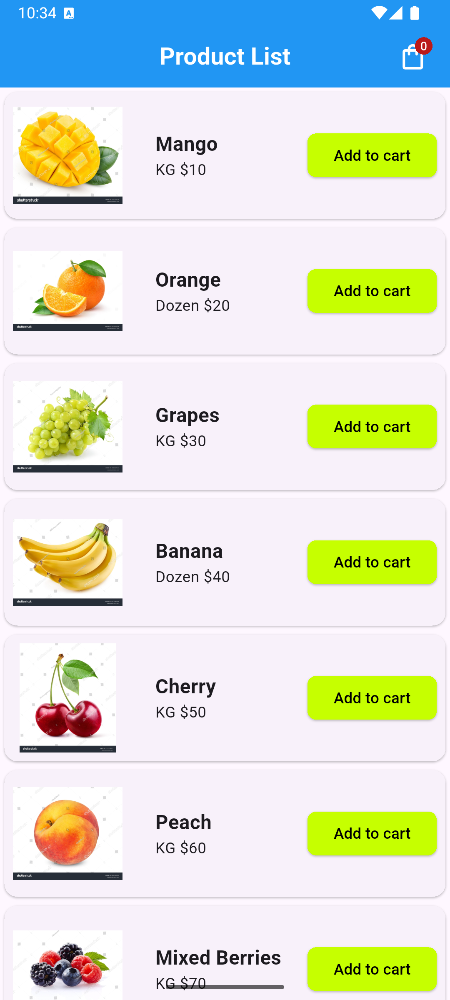
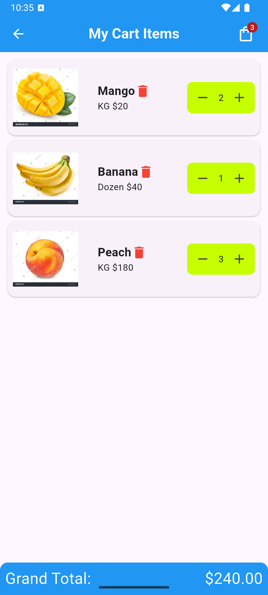
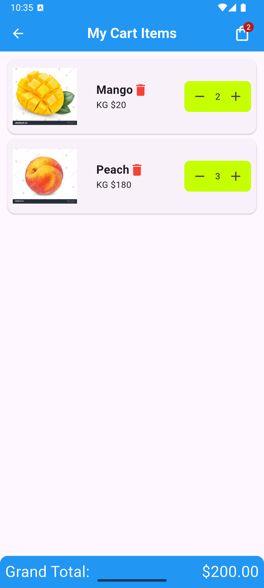

# 🛒 Flutter Shopping Cart with Sqflite and Provider

A minimal shopping cart app built using **Flutter**, with **Sqflite** for local database storage, **Provider** for state management, and **SharedPreferences** for data persistence.

---

## 📱 Features

- 🧾 Static product list with "Add to Cart" functionality
- 📦 View cart with quantity control (increment/decrement)
- 🗑️ Remove items from cart
- 💰 Total price calculation
- 🧠 State management using Provider
- 💾 Persistent local storage using Sqflite and SharedPreferences
- 🎨 Clean and simple UI
---

## 📸 Screenshots
### **Product List**
> View product list

> Badge updated after adding items to cart

### **User's Cart**
> View items added to cart

> Managing quantity of products

> Deleting items from cart

### **Empty Cart**

---

## Dependencies ⚙️

This project uses the following dependencies:

- [`provider`](https://pub.dev/packages/provider): State management solution built on top of InheritedWidget.
- [`sqflite`](https://pub.dev/packages/sqflite): SQLite plugin for Flutter to store and retrieve structured data.
- [`path_provider`](https://pub.dev/packages/path_provider): Provides commonly used locations on the filesystem.
- [`path`](https://pub.dev/packages/path): A package for working with file and directory paths.
- [`shared_preferences`](https://pub.dev/packages/shared_preferences): Used to persist theme preference across app sessions.

---

##  Tech Stack 🛠️
- **Flutter**: UI toolkit for building natively compiled applications.
- **Dart**: The language used to develop Flutter apps.
- **SQLite + sqflite**: Local relational database engine.
- **Provider**: State management solution for Flutter.
- **Shared Preferences**: Persistent key-value storage for lightweight data like theme mode.
- **VS Code / Android Studio**: Development environments.
- **Git**: Version control for source code.
---